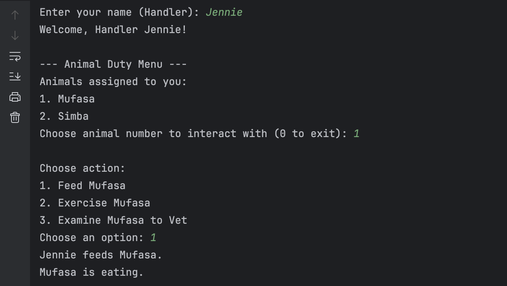
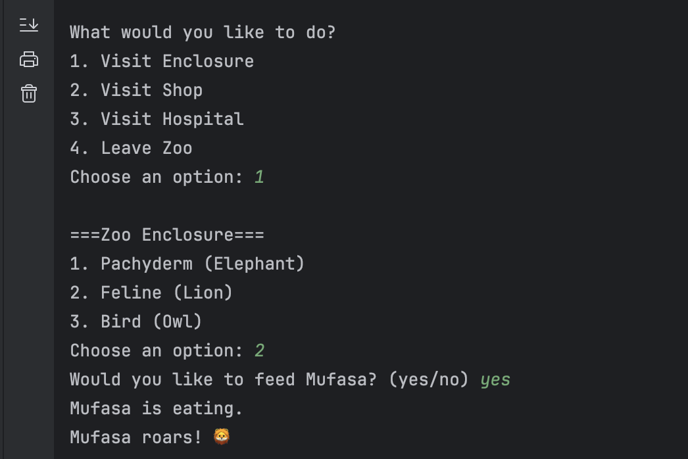

# FECP-SpringBoot-Session1

## Project Title
Lab 1: UML Class Diagram to Java Program

## Team Members
- Dzelle Faith Tan
- Kayne Uriel Rodrigo
- Andre Dominic Lacra

## Application Walkthrough

### Main Menu

### Zoo Staff Setup

### Handler Module: Feed Animal

### Handler Module: Exercise & Examine

### Handler Module: Exit

### Admin: Open Zoo

### Ticketing: Child Visitor

### Ticketing: Student Visitor

### Ticketing: Adult Visitor

### Ticketing: Senior Visitor

### Visitor: Visit Enclosure

### Visitor: Visit Shop

### Visitor: Visit Hospital

